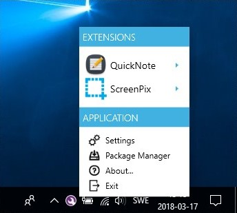
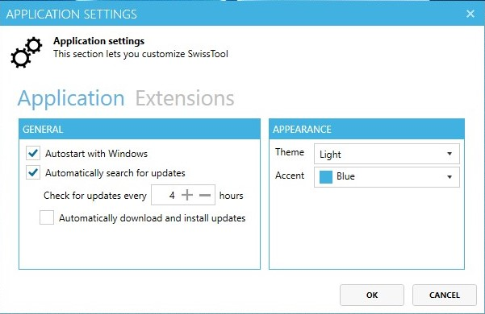
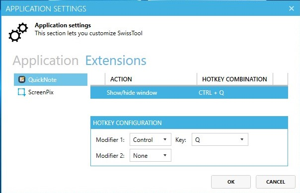
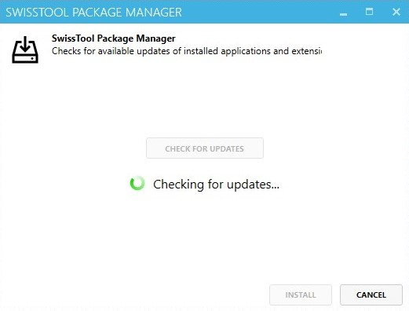

#  SwissTool

SwissTool at its core is designed to be a light-weight host application for plugins. SwissTool allows for powerful plugin development with little effort by providing an easy way to assign global hotkeys to commands. The primary aim with SwissTool is speed and to make every day tools available at all times

## Demo

## Installer
**Windows:**
[SwissTool v2.2.2](https://github.com/winkvist/SwissTool/releases/download/2.2.2/Installer.zip) (includes [QuickNote](https://github.com/winkvist/SwissTool.Ext.QuickNote) and [ScreenPix](https://github.com/winkvist/SwissTool.Ext.ScreenPix))

## Developer?
Check out the tutorial on plugin development to get started.
* [Plugin Development](https://github.com/winkvist/SwissTool/wiki/Plugin-Development)

## Screenshots

